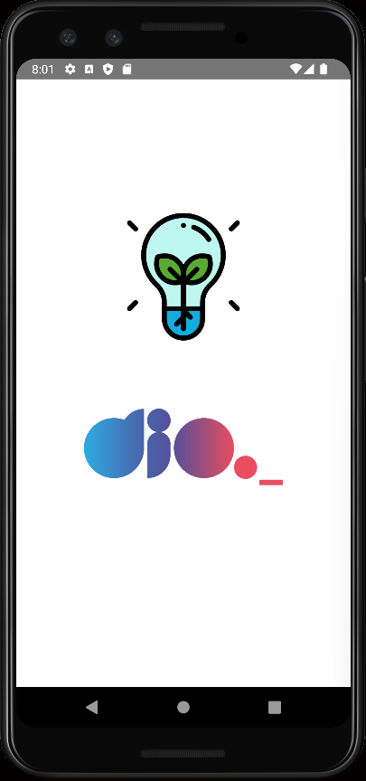
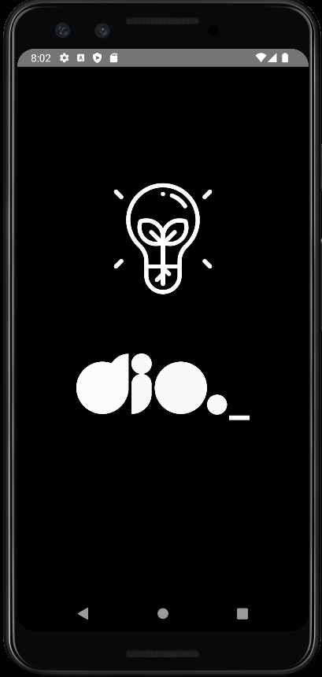

# DIO Flash Light 
Desafio do bootcamp Decola Tech, construção de um app ultilizando duas   bibliotecas para interações com funções nativas do android.

# Conteúdo
- Bibliotecas trabalhadas
  - react-native-shake 
  - react-native-torch 
- Projeto
  - Hook useState
  - Hook useEffect
  - Add Listner to RNShake
 - Lifecicle ReactJS
